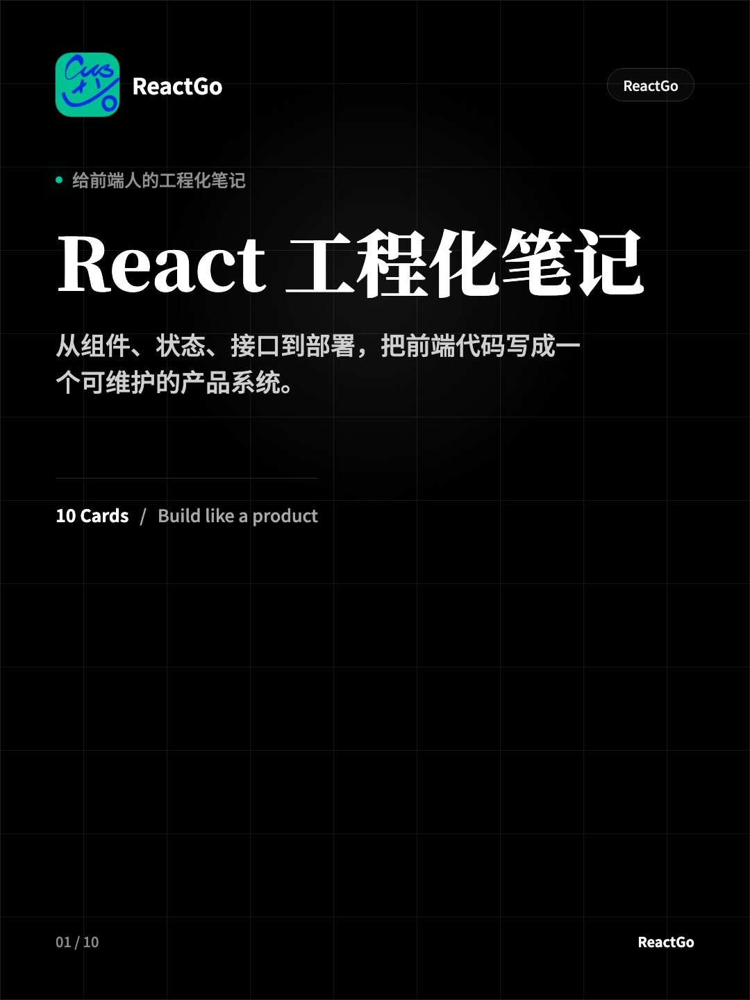
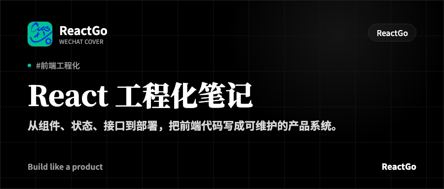
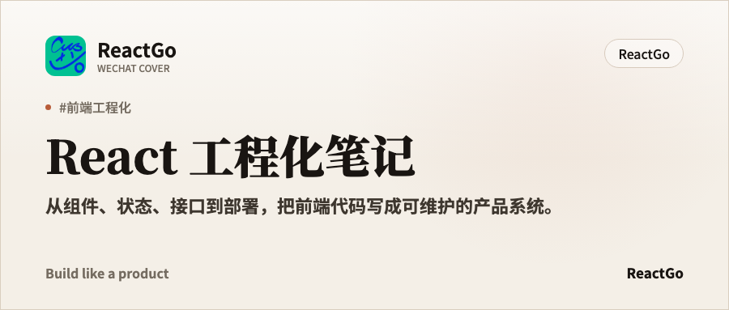
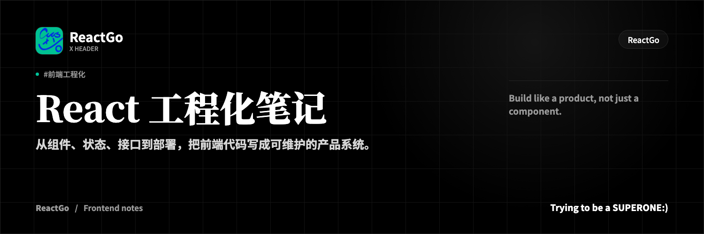

# BemoSkill-Cards

Reusable Codex skill for generating dark/light social cards and platform covers with deterministic HTML/CSS rendering.

## Install

Install from GitHub with the Skills CLI:

```bash
npx skills add Mengbooo/BemoSkill-Cards
```

Then invoke the skill by name:

```text
Use $bemoskill-cards to turn this topic into dark/light Xiaohongshu cards plus WeChat and X/Twitter covers.
```

## What It Generates

- Xiaohongshu / Rednote portrait cards: `1080x1440`
- WeChat official account covers: `900x383`
- X / Twitter headers: `1500x500`
- Two visual modes:
  - `dark`: black, white type, sparse technical grid
  - `light`: warm paper, charcoal type, restrained editorial accent

## Examples

### Xiaohongshu Cover

| Dark | Light |
| --- | --- |
|  |  |

### WeChat Cover

| Dark | Light |
| --- | --- |
|  |  |

### X / Twitter Header

| Dark | Light |
| --- | --- |
|  |  |

## Render Templates

The included templates can be rendered locally:

```bash
npm install
npm run render:xhs-dark
npm run render:xhs-light
npm run render:platform
npm run overview:platform
```

Generated PNGs are written to `output/`, which is ignored by git.

## Structure

```text
SKILL.md
agents/openai.yaml
assets/
  examples/
  fonts/
  templates/
references/
scripts/
```

The renderer screenshots HTML nodes with Playwright, so exact text, logo placement, and platform dimensions remain controllable.
